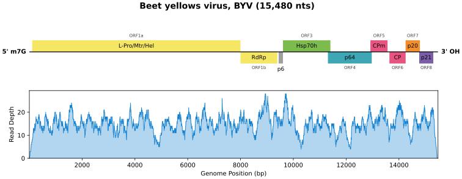
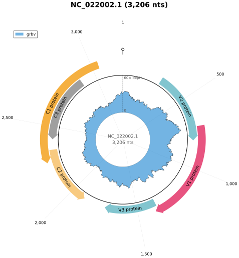
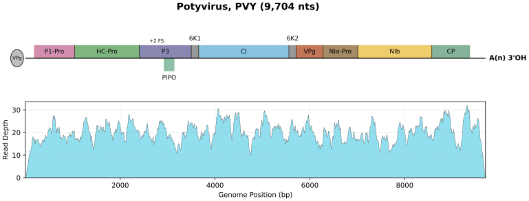
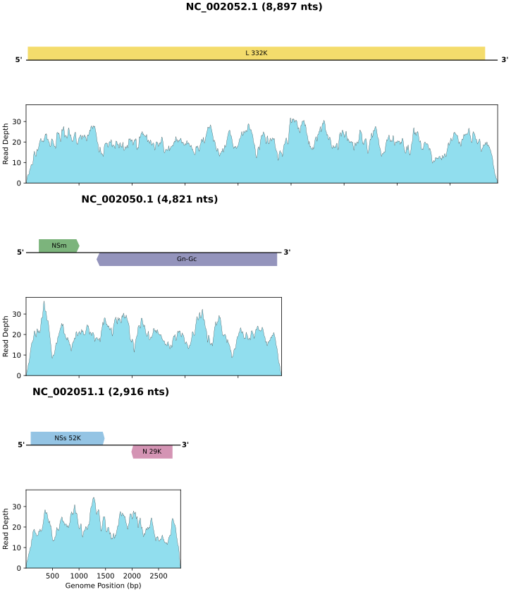

# VirPlot

This tool generates **SVG, PDF, or PNG plots** that combine viral genome feature annotations from a GFF3 file and sequencing depth — from a `samtools depth` file, from SAM/BAM alignments, or straight from FASTQ reads that VirPlot maps to the reference with bowtie2.

[](https://i.imgur.com/bDxrx1I.png)

| Linear, one strand — BYV (`examples/byv.gff3` + `byv.yml`) | Circular, two strands — GRBV (`examples/grbv.gff3`) |
|---|---|
|  |  |

Polyprotein — PVY (`examples/pvy.gff3` + `pvy.yml`): RefSeq's mature-protein rows become the segments of one box.



Segmented — TSWV (`examples/tswv.gff3` + `tswv.yml`): one figure per segment on a shared scale, composed into the ICTV stacked figure by `bin/stack_figures.py`.



Reads in the examples are simulated; the annotations are real RefSeq records. More renders in [`docs/figures/`](docs/figures/); `sh docs/make_figures.sh` regenerates them.

Developed and maintained by Haoran (Henry) Li for [Foundation Plant Services](https://fps.ucdavis.edu/index.cfm) at [UC Davis](https://www.ucdavis.edu/).

Built in Python using `matplotlib`, `pyyaml`, and `numpy`.

---

## Overview

In Next Generation Sequencing (NGS), read **depth** provides a measure of how confidently a region of the genome was sequenced. When depth is visualized alongside gene or product annotations, it allows researchers to:

- Identify under or over-sequenced regions.
- Assess the relationship between functional elements and read depth.
- Validate annotations visually.
- Visualize contiguous coverage intervals and reveal potential breaks or low-support regions.

This tool generates a vertically stacked plot:

- **Top**: Gene product annotations (e.g. RdRp, CP, MP, etc.) as labeled colored boxes on a genome line.
- **Bottom**: Sequencing depth plot over the same genomic range, with optional shading of below-threshold gaps.

Both plots are **aligned on a shared x-axis** and exported as vector-format graphics suitable for publications.

---

Annotation-track drawing conventions follow the ICTV 9th Report family figures: colour encodes function, glyphs are flat colour without outlines, one-strand genomes flip a box across the line where ORFs overlap or where two same-colour boxes would otherwise merge, two-strand genomes draw + above and − below as arrows, and circular genomes nest overlapping arcs inward. See [`docs/ictv_drawing_conventions.md`](docs/ictv_drawing_conventions.md) for the spec, the implementation status, and the spec changes it turned up.

---

## Installation

Requires Python 3.9+.

```bash
pip install .
```

---

## Quick Start

Example data in `examples/`: a synthetic two-segment genome (`sample.gff3`, `sample_multi.gff3`, `sample.dep`, `sample.sam`, `spec.yml`); beet yellows virus with its real RefSeq NC_001598.1 coordinates, ICTV ORF names and the ICTV figure palette (`byv.gff3`, `byv.sam`, `byv.yml`); a circular one — grapevine red blotch virus, real RefSeq NC_022002.1 annotation (`grbv.gff3`, `grbv.sam`, `grbv.yml`); and a polyprotein — potato virus Y, RefSeq NC_001616.1 with its `mature_protein_region_of_CDS` rows (`pvy.gff3`, `pvy.sam`, `pvy.yml`). Reads in the `.sam` files are simulated (`make_reads.py`, `make_grbv_sam.py`, `make_example_sam.py`).

```bash
# Basic plot
virplot -g examples/sample.gff3 -d examples/sample.dep -y examples/spec.yml
```

```bash
# PNG with smoothing, gap shading, and grid
virplot -g examples/sample.gff3 -d examples/sample.dep -y examples/spec.yml \
  --smooth --shade-breaks --grid -f png
```

```bash
# PDF with custom name and output directory
virplot -g genome.gff3 -d depth.dep -y spec.yml \
  -f pdf --name my_virus -o results/
```

To create your own configuration, copy the template and edit the color mappings:

```bash
cp examples/spec.yml my_project.yml
```

---

## Inputs

Three input files are required:

1. **GFF3 file** — genome annotations: a `region` entry per RNA giving its length, the CDS features, and optionally a polyprotein's mature-protein rows and non-coding landmarks (UTRs, intergenic regions, stem-loops), all as RefSeq writes them (see [`docs/GFF_GUIDE.md`](docs/GFF_GUIDE.md) for the conventions)
2. **Depth source** — one of
   - FASTQ reads plus a reference FASTA (`-x`, `-U`/`-1`/`-2`); VirPlot runs bowtie2 and reads its SAM, **or**
   - tab-delimited output from `samtools depth -a`, **or**
   - a **SAM or BAM** file; VirPlot computes per-base depth from the alignments itself (no `samtools`/`pysam` needed)
3. **YAML file** — color mapping and style settings (see [Customization](#customization))

If multiple depth sources are given, VirPlot combines them into a *stacked area chart* showing each sample's depth contribution under a combined depth line. Depth files and SAM/BAM files can be mixed.

### Multiple RNAs (segmented genomes)

If the GFF contains several `region` lines — one per genome segment, satellite or subgenomic RNA — VirPlot plots each one, writing `<name>.<seqid>.<format>` (and per-RNA CSV reports). Depth is matched to each RNA by sequence id, so a single SAM/BAM (or a multi-sequence `samtools depth` file) covers all of them:

```bash
virplot -g examples/sample_multi.gff3 -d examples/sample.sam -y examples/spec.yml --smooth --shade-breaks
# -> virplot.SyntheticVirus1.svg, virplot.SyntheticVirus2.svg
```

So the separate figures can be laid side by side without misleading the reader, they share one depth y-limit and their widths are proportional to RNA length. `--free-y` and `--equal-width` switch either behaviour off; `--rnas SEQID [SEQID ...]` selects and orders a subset. With `--normalize`, depth is scaled by the maximum across all plotted RNAs.

### Circular genomes

A genome is treated as circular when its GFF `region` line carries the GFF3 attribute `Is_circular=true` (as NCBI RefSeq records do); `--topology circular|linear` overrides that.

Aligners have no notion of a circular reference — bowtie2, BWA and minimap2 all treat the reference as a linear string — so a read spanning the origin is soft-clipped or lost, leaving a false coverage dip about one read length wide at position 1. The usual fix is to pad the reference by a read length, align, then wrap the coordinates back. VirPlot completes that: for a circular genome, alignments running off the end continue from position 1, and positions past the end are taken modulo the genome length.

```bash
# grapevine red blotch virus, 3206 nt circular (RefSeq NC_022002.1)
virplot -g examples/grbv.gff3 -d examples/grbv.sam -y examples/grbv.yml --legend --title

# same reads, origin ignored — note the ramp over the first 150 bp
virplot -g examples/grbv.gff3 -d examples/grbv.sam -y examples/grbv.yml --topology linear
```

On a circular genome the linear layout drops the 5′/3′ marks and shows the backbone continuing past both edges instead.

#### Circular layout

`--layout circular` draws the genome as a circle instead: feature arcs in an outer ring (two lanes, so overlapping ORFs stay legible), read depth as a filled band inside it, position 1 at the top and coordinates running clockwise. A feature crossing the origin is drawn as the two arcs it occupies rather than being clipped.

```bash
virplot -g examples/grbv.gff3 -d examples/grbv.sam -y examples/grbv.yml \
  --layout circular --legend --title
```

`--layout auto` — **the default** — uses the circle for genomes the GFF marks `Is_circular=true` and the linear track for the rest, which is also what you want when one GFF holds both. A `layout:` key in spec.yml sets a per-example default beside the data it styles; `--layout` overrides it.

To get the linear track of a circular genome, pass `--layout linear` (or set `layout: linear`). Do **not** delete `Is_circular=true` to achieve it: that attribute says what the molecule *is*, and removing it also turns off depth wrapping at the origin and the splitting of origin-crossing features. The linear track is still the better picture of a densely annotated genome — it carries far more labels legibly — and it is the only layout that draws the `±1 FS` / `RT` marks and sgRNA rows, so a circular figure warns when it has to leave those out.

Two spec.yml keys move the circle closer to the ICTV figures: `circular_labels: horizontal` writes every label level outside the ring as `ORF (product)`, and `circular_arcs: on_circle` sets the innermost arcs astride the genome circle (`examples/grbv_ictv.yml`).

Layout and topology are independent. `--topology` decides whether depth wraps at the origin (the arithmetic); `--layout` decides how it is drawn. Drawing a circular genome with `--topology linear` renders the false origin dip as a wedge cut out of the ring at 12 o'clock — a quick way to see whether your pipeline handled the origin.

`--yscale symlog` has no meaning on a radial axis and is ignored in this layout.

### Depth from FASTQ reads (bowtie2)

Give reads and a reference and VirPlot maps them for you. The options mirror bowtie2's: `-U` for unpaired reads, `-1`/`-2` for mates, `-p` for threads. Each `-U` (or `-1`/`-2` pair) is one sample; comma-separate files that belong to the same sample, as bowtie2 does. `-x` takes the reference **FASTA** — an existing bowtie2 index beside it is used, otherwise one is built under `--outdir` and reused.

```bash
# one unpaired sample
virplot -g grbv.gff3 -x grbv.fasta -U vine7.fastq.gz -y examples/grbv.yml -p 8 --smooth

# two paired samples plus an existing depth file, stacked
virplot -g byv.gff3 -x byv.fasta -1 a_R1.fq.gz -2 a_R2.fq.gz -1 b_R1.fq.gz -2 b_R2.fq.gz \
        -d earlier.dep -l earlier a b -y examples/byv.yml --legend
```

The SAM bowtie2 writes is kept as `<name>.<label>.sam` in the output directory, and bowtie2's alignment summary is logged. `--bowtie2-args "--local --very-sensitive"` passes options through verbatim. Needs `bowtie2` and `bowtie2-build` on `PATH` (`conda install -c bioconda bowtie2`); nothing else in VirPlot depends on them.

Two notes. Labels from `-l` apply to `-d` sources first, then to each sample in command-line order. And bowtie2 treats every reference as linear: for a circular genome, reads across the origin are soft-clipped or lost unless you pad the reference by a read length first — VirPlot will wrap a padded alignment back correctly (see *Circular genomes*), but it does not pad the FASTA for you yet.

### Depth from SAM/BAM

```bash
virplot -g examples/sample.gff3 -d examples/sample.sam -y examples/spec.yml --smooth --shade-breaks
```

The file type is detected from the extension (`.sam`, `.bam`) or, failing that, from the content. Counting follows `samtools depth -a` defaults so results are directly comparable:

- unmapped, secondary, QC-fail and duplicate reads are skipped;
- only aligned bases (CIGAR `M`, `=`, `X`) count — deletions and `N` skips do not;
- no mapping-quality filter unless `--min-mapq` is given.

The reference to plot is taken from the GFF `region` line's sequence id. If the SAM/BAM header has a single `@SQ` entry that one is used regardless; if it has several and none matches, pass `--ref NAME`. BAM is read via the standard library's gzip module; CRAM is not supported.

---

## Usage

```txt
virplot [-h] [-V] -g GFF [-d DEPTH [DEPTH ...]] [-l LABELS [LABELS ...]]
        [-x FASTA] [-U FASTQ[,FASTQ...]] [-1 FASTQ[,FASTQ...]] [-2 FASTQ[,FASTQ...]]
        [-p THREADS] [--bowtie2-args ARGS]
        [--ref REF] [--rnas SEQID [SEQID ...]] [--topology {auto,circular,linear}]
        [--layout {linear,circular,auto}] [--free-y] [--equal-width]
        [--min-mapq MIN_MAPQ] -y YAML [-o OUTDIR] [-n] [--grid] [--smooth]
        [--yscale {linear,symlog}] [--linthresh LINTHRESH]
        [--name NAME] [--no-label] [--border | --no-border]
        [-t THRESHOLDS [THRESHOLDS ...]] [-r] [--shade-breaks]
        [--legend] [--title] [-f {svg,pdf,png}] [-v]
```

### Options

| Flag                 | Description                                                    |
| -------------------- | -------------------------------------------------------------- |
| `-g`, `--gff`        | Path to GFF3 annotation file                                   |
| `-d`, `--depth`      | Depth sources — `samtools depth` files or SAM/BAM (stacked if multiple); optional when reads are given |
| `-x`, `--reference`  | Reference FASTA for mapping reads with bowtie2 (index built and cached under `--outdir`) |
| `-U`                 | Unpaired FASTQ for one sample; repeat for more samples; comma-separate files of one sample |
| `-1`, `-2`           | Mate-1 / mate-2 FASTQ for one paired sample; repeat the pair for more samples |
| `-p`, `--threads`    | Threads for bowtie2 and bowtie2-build (default: 1) |
| `--bowtie2-args`     | Extra options passed to bowtie2 verbatim |
| `-l`, `--labels`     | Label(s) for each depth source (same order as `--depth`)       |
| `--ref`              | Reference name to use from SAM/BAM/depth files when it differs from the GFF sequence id (single-RNA GFF only) |
| `--rnas`             | Plot only these GFF sequence ids, in this order (default: every `region`) |
| `--free-y`           | With several RNAs, let each figure pick its own y-limit          |
| `--equal-width`      | With several RNAs, draw every figure at full width               |
| `--min-mapq`         | Skip SAM/BAM reads with MAPQ below this (default: 0)           |
| `--topology`         | `auto` (from the GFF `Is_circular` attribute), `circular` or `linear` |
| `--layout`           | `linear` (default), `circular`, or `auto` to draw circular genomes as circles |
| `-y`, `--yaml`       | YAML file for color mapping and other specs                    |
| `-o`, `--outdir`     | Output directory (default: `.`)                                |
| `-f`, `--format`     | Output format: `svg`, `pdf`, or `png` (default: `svg`)         |
| `--name`             | Base name for output file (default: `virplot`)                 |
| `-n`, `--normalize`  | Normalize depth values to max=1                                |
| `--smooth`           | Smooth depth plot using moving average                         |
| `--grid`             | Enable background grid on depth plot                           |
| `--yscale`           | Y-axis scale: `linear` or `symlog` (default: `linear`)         |
| `--linthresh`        | Symlog linear threshold around 0 (default: `10.0`)             |
| `--no-label`         | Hide feature labels                                            |
| `--border`, `--no-border` | Outline feature glyphs in black, or draw them as flat colour (default: `--no-border`) |
| `-t`, `--thresholds` | Coverage thresholds for interval/gap analysis (default: `1 5`) |
| `-r`, `--report`     | Write CSV reports of intervals and gaps per threshold          |
| `--shade-breaks`     | Shade coverage gaps on the depth plot                          |
| `--legend`           | Show depth plot legend                                         |
| `--title`            | Show title from YAML                                           |
| `-v`, `--verbose`    | Enable debug-level logging                                     |
| `-V`, `--version`    | Show version and exit                                          |

---

## Customization

All visual elements are customizable via the YAML file:

| Key                   | Description                           |
| --------------------- | ------------------------------------- |
| `color_mapping`       | Maps product names to hex colors      |
| `default_color`       | Color for unmapped products           |
| `shade_color`         | Color for shaded gap regions          |
| `depth_line_color`    | Fill colour of a single depth track (default `#85dbec`) |
| `circular_labels`     | `tangential` (default, along the arc) or `horizontal` (level, outside the ring, `ORF (product)`, as in the ICTV figures) |
| `circular_arcs`       | `outside` (default, arcs just outside the genome circle) or `on_circle` (innermost arcs astride the circle, as in the ICTV figures) |
| `annotation_fontsize` | Font size for feature labels          |
| `stacked_area_colors` | Color palette for stacked area chart  |
| `legend_location`     | Legend position (e.g. `"upper left"`) |
| `title`               | Plot title text                       |

See `examples/spec.yml` for a complete template.

---

## Documentation

| Document | What it covers |
|---|---|
| [`docs/GFF_GUIDE.md`](docs/GFF_GUIDE.md) | How to write the GFF3: the rows VirPlot reads, `product`/`gene` naming, strand and layout, `Is_circular`, origin-crossing features, frameshifts and readthrough, polyprotein domains, non-coding landmarks, and the function words that pick default colours |
| [`docs/ARCHITECTURE.md`](docs/ARCHITECTURE.md) | How the code is organised: data model, pipeline, **class diagram**, the behaviours that are easy to get wrong, how to extend it, the test suites |
| [`docs/ictv_drawing_conventions.md`](docs/ictv_drawing_conventions.md) | The genome-map drawing rules the annotation track follows, their implementation status, and how they compare with the published ICTV figures |
| [`docs/class_layout.svg`](docs/class_layout.svg) | The class layout as a static diagram |
| [`CHANGELOG.md`](CHANGELOG.md) | What changed, by release |

## Development

```bash
git clone https://github.com/kastevens/VirPlot
cd VirPlot
pip install -e . pytest
pytest                      # ~120 tests, no network or external tools needed
```

The package lives in `src/virplot/`; `python -m virplot` runs the CLI from a checkout. Rendering changes should be checked by re-plotting the examples and comparing with the previous output — every depth-panel change on the current branch has been verified pixel-identical that way. See `docs/ARCHITECTURE.md` §6 for where to plug in a new renderer, depth source or placement rule.

## Supplementary Scripts

Three standalone scripts in `bin/` assist with depth file preparation and
figure composition:

- **`depth_filter.py`** — Filter depth entries by sequence header:

  ```bash
  python3 bin/depth_filter.py -i input.dep -o filtered.dep --seq SEQ_NAME
  ```

- **`depth_merger.py`** — Merge depth counts across multiple files:

  ```bash
  python3 bin/depth_merger.py -i sample1.dep sample2.dep -o combined.dep
  ```

- **`stack_figures.py`** — Stack a segmented genome's figures into one
  ICTV-style multipartite figure (DNA-A/DNA-B, LIYV RNA-1/RNA-2, TSWV L/M/S,
  nanovirus components). Render the segments in **one** run so they share a
  scale and a depth y-limit, then compose:

  ```bash
  virplot -g tswv.gff3 -d tswv.sam -y tswv.yml -f svg --bare-x -o out --name tswv
  python3 bin/stack_figures.py -i out/tswv.*.svg -o out/tswv_stacked.svg
  ```

  Segments render largest first by default (`--rna-order`), `--bare-x` leaves
  the x-axis on the bottom panel only, and the composer aligns the panels' plot
  areas. VirPlot has no stacked-figure renderer because it does not need one:
  within a run the panels already share an exact x-scale, so stacking is a
  document operation — see `docs/ictv_drawing_conventions.md` §6 G.

---

## License

This project is released under the MIT License.
