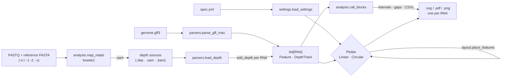
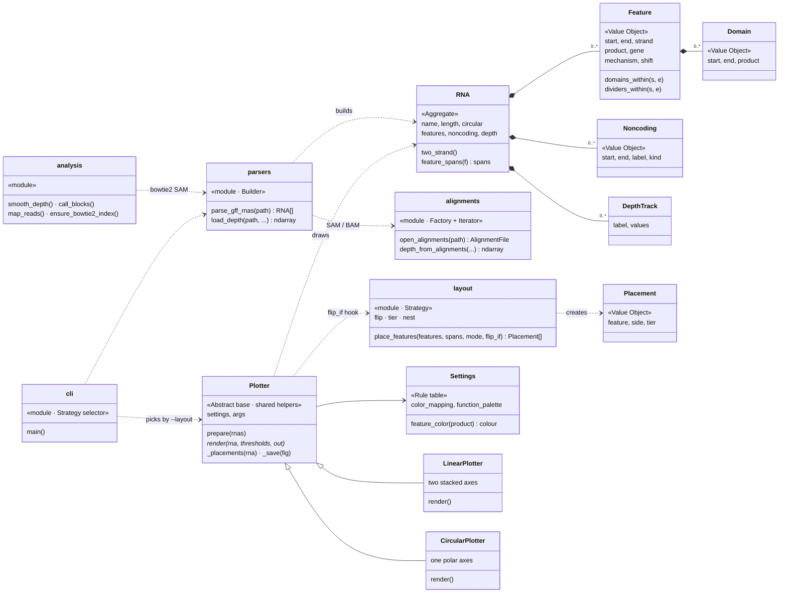
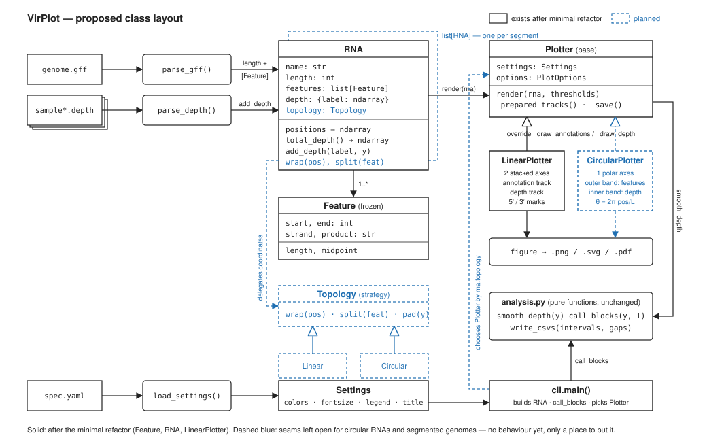

# VirPlot architecture

VirPlot turns a GFF3 annotation and one or more depth sources into a figure
that shows read depth beneath (or inside) a genome map. This document is for
anyone changing the code: what the pieces are, how a run flows through them,
and where to plug in new behaviour. User-facing options are in the
[README](../README.md); the drawing rules the annotation track follows are in
[`ictv_drawing_conventions.md`](ictv_drawing_conventions.md).

Pure Python: `numpy`, `matplotlib`, `pyyaml` and the standard library. No
`samtools`, `pysam` or compiled extensions.

## 1. The pipeline in one picture



`cli.main()` is the only place that knows about all of these; every other
module is importable and testable on its own.

## 2. Module map

| Module | Responsibility | Depends on |
|---|---|---|
| `models.py` | The data model: `Feature`, `DepthTrack`, `RNA`. Coordinate helpers that know about circularity (`feature_spans`). | numpy |
| `parsers.py` | GFF3 → `list[RNA]`; `samtools depth` text → array; `load_depth` dispatches any depth source by type. | models, alignments |
| `alignments.py` | SAM and BAM readers (BAM through `gzip`), CIGAR walk → per-base depth with `samtools depth -a` semantics, origin wrapping for circular genomes, reference-name resolution. | numpy, stdlib |
| `analysis.py` | Two halves. Pure functions over depth arrays: moving-average smoothing, interval/gap calling at a threshold, CSV reports. And read mapping: `ReadSet`, bowtie2 index building and caching, `map_reads` running bowtie2 to a SAM that the depth pipeline then consumes. | numpy, subprocess |
| `settings.py` | `Settings` dataclass from YAML; the ICTV function palette and the product-name classifier behind `Settings.feature_color`. | pyyaml |
| `layout.py` | Where each feature glyph goes: `place_features` implements the flip / tier / nest rules and returns `Placement`s. Pure; no matplotlib. | models |
| `plotting.py` | `Plotter` base (shared scaling, legend, title, save) and the two renderers, `LinearPlotter` and `CircularPlotter`. | analysis, layout, models, settings, matplotlib |
| `cli.py` | Argument parsing, input validation, the per-RNA loop, plotter selection. | everything above |

Import direction is strictly downward in that table: `models` imports nothing
of ours, `cli` imports everything. `analysis` and `layout` never touch a
figure, which is what makes the placement rules and the coverage statistics
unit-testable without rendering.

## 3. Class diagram



Guillemets mark the design patterns the code happens to use — none was
designed in up front, each fell out of a simpler need:

* **Value Object** — `Feature`, `Domain`, `Noncoding`, `Placement` are frozen
  dataclasses: compared by value, safe to share, replaced rather than mutated
  (`parsers._with`).
* **Aggregate** — `RNA` is the one mutable object; it owns its features,
  landmarks and depth tracks, and every function downstream takes an `RNA`.
* **Builder** — `parsers.parse_gff_rnas` assembles RNAs over several passes
  (rows → joins → mechanisms → domains → landmarks) before anyone sees them.
* **Factory + Iterator** — `alignments.open_alignments` sniffs SAM vs BAM and
  returns an `AlignmentFile` whose `records()` is a lazy generator, so a
  BAM is never held in memory.
* **Strategy** — twice. `layout.place_features(mode)` dispatches to
  `flip` / `tier` / `nest`, and the CLI picks `LinearPlotter` or
  `CircularPlotter` per RNA from `--layout`. `flip_if` is a hook the plotter
  injects so the pure layout module never learns about colour.
* **Rule table** — `Settings.feature_color` and `classify_function` are an
  ordered list of (pattern → class) with explicit overrides first; adding a
  function class is one row.

The same picture as a static image:



Two design choices are worth stating because they are easy to undo by
accident:

* **`RNA` is the unit of work.** Everything about one molecule travels in one
  object — length, topology, features, every sample's depth track. Functions
  take an `RNA`, not five parallel lists. The name is historical; GRBV is
  ssDNA and the class serves it unchanged, so `Molecule` would be more honest
  if the API is ever versioned.
* **Placement and colour are decided outside the renderers.** `layout.py`
  says *where* a glyph goes and `Settings.feature_color` says *what colour*;
  the plotters only draw. That is why the ICTV rules could be checked against
  the published figures with plain asserts (see
  `tests/test_conventions.py`) and why a third renderer would inherit them
  for free.

## 4. A run, step by step

`cli.main()` does the following, in order:

1. **Validate inputs** — files exist, label count matches depth-source count
   (`-d` sources plus one per `-U` / `-1`+`-2` sample).
2. **Parse annotation** — `parse_gff_rnas` returns one `RNA` per GFF
   `region` line, in file order, with `circular` set from the
   `Is_circular=true` attribute. CDS rows sharing an `ID` with
   `exception=ribosomal slippage` become one box per segment with the
   continuation marked `mechanism="frameshift"` (sign from the join
   geometry); a CDS with `transl_except=` is trimmed to its extension and
   marked `"readthrough"`; `Note=` can state either for hand-written files.
   `mature_protein_region_of_CDS` / `mat_peptide` rows become the `Domain`
   segments of the CDS named by their `Parent=` (or the smallest CDS that
   contains them). UTR, intergenic-region and stem-loop rows become
   `RNA.noncoding` landmarks (RefSeq's catch-all `sequence_feature` rows only
   when their words say non-coding). `--rnas` selects and orders a subset;
   `--topology` overrides circularity for all of them.
3. **Map reads** — if `-U`/`-1`/`-2` were given, `_map_read_sets` checks
   bowtie2 is on `PATH`, warns where the reference FASTA's lengths disagree
   with the GFF, gets an index (`ensure_bowtie2_index`: beside the FASTA,
   else built and cached under `--outdir`), and runs bowtie2 once per sample
   to `<name>.<label>.sam`. Those SAMs are appended to the depth sources.
4. **Load depth** — for each RNA and each depth source, `load_depth` sniffs
   the file (`.sam`/`.bam` by extension, then gzip magic, then a leading `@`)
   and either parses `samtools depth` text or walks the alignments. The
   RNA's `seqid` picks the reference; a file with exactly one reference is
   accepted under any name; anything ambiguous is an error naming the
   candidates (`resolve_reference`). For a circular RNA, alignment blocks
   that run off the end wrap round to position 1.
5. **Settings** — `load_settings` reads the YAML, warns on unknown keys,
   resolves `overlap_mode` and merges the function palette.
6. **Prepare plotters** — one `LinearPlotter` and one `CircularPlotter`, each
   with `prepare(rnas)`: across all RNAs it fixes the shared depth y-limit,
   the `--normalize` denominator and the reference length for
   width-proportional figures, so separate files compose honestly.
   `--free-y` / `--equal-width` opt out.
7. **Per RNA** — `call_blocks` on the total depth at each `-t` threshold
   (logged, and written as CSVs with `--report`); then the renderer chosen by
   `--layout` (`linear`, `circular`, or `auto` = circular for circular RNAs)
   renders to `<name>.<seqid>.<fmt>`, or plain `<name>.<fmt>` for a single RNA.

## 5. Behaviours that are easy to get wrong

**Depth from alignments matches `samtools depth -a`.** Reads flagged
unmapped, secondary, QC-fail or duplicate are skipped; only CIGAR `M`/`=`/`X`
bases count (deletions and `N` skips do not); supplementary alignments count;
no MAPQ or base-quality floor unless `--min-mapq`. Counting uses a difference
array so cost is O(reads + genome), not O(bases). `tests/test_alignments.py`
cross-checks 300 random reads against a brute-force per-base counter.

**Circular genomes wrap in the data layer, not the plotter.** No aligner
knows about circular references; the standard fix is to align against a
reference padded by a read length and wrap the coordinates back. VirPlot
finishes that: with `RNA.circular`, `_add_wrapped` splits an overrunning
block into `[s, L)` and `[0, e−L)`, and positions past the end are taken
modulo `L`. Drawing a circular genome with `--topology linear` therefore
shows the false origin dip — a deliberate diagnostic.

**Origin-crossing features are two spans.** `RNA.feature_spans` turns a
feature recorded as `start > end`, or with `end` past the length, into the
arcs it occupies; both renderers and the overlap test consume spans, never
raw `start`/`end`.

**Layout rules (see the conventions doc for the source figures).**
`resolve_mode("auto", two_strand)` picks `flip` for one-strand genomes and
`tier` for two-strand ones; circular renderers always use `nest`.
- `flip`: 5′-most feature above; a frameshift continuation always flips and
  a readthrough extension always stays with the box it abuts; otherwise flip
  across the line when overlapping the upstream neighbour, or when that
  neighbour is the same colour and closer than `NEAR_GAP_FRACTION` (1 %) of
  the genome — glyphs have no outline by default (`--no-border`), so
  two adjacent same-colour boxes would otherwise merge (the plotter passes
  this test in as `flip_if`, keeping `layout.py` colour-blind); if the
  wanted side is already occupied there, try the other side, then tier
  outward.
- `tier`: side fixed by strand (+ above, − below); same-side overlap tiers
  further from the line; glyphs are arrows.
- `nest`: placed largest first on the outer lane; an arc overlapping one
  already placed steps one lane inward.

**Colour encodes function, never strand.** `Settings.feature_color`:
explicit `color_mapping` → keyword class from the product name (`RdRp`,
`coat protein`, `movement`, `HSP70`, `silencing suppressor`) → `default_color`.
A bare `p20` carries no function and stays default until mapped. "Putative"
in the name lightens the class colour.

**Cross-RNA scaling is computed once.** `Plotter.prepare` reads every RNA's
smoothed total before any figure is drawn; `_prepared_tracks` then applies
smoothing and normalisation identically for the depth panel and the y-limit,
which the pre-refactor code computed twice.

## 6. Extending VirPlot

**A new renderer.** Subclass `Plotter`, implement `render(rna,
threshold_results, out_base)`, and call the inherited helpers:
`self._placements(rna, circular=...)` for glyph positions,
`self._feature_color(product)` for colour, `self._prepared_tracks(rna)` for
smoothed/normalised depth, `self._add_legend`, `self._add_title`,
`self._save`. Then add it to the `--layout` choices in `cli.py`. A
`StackedPlotter` for segmented genomes would draw N rows sharing one x-scale
and needs nothing new from the model.

**Mapping** is deliberately thin: `map_reads` builds a bowtie2 command and
reads its exit status and stderr; VirPlot never parses bowtie2's output beyond
logging the summary, and the SAM goes through the same `load_depth` as any
other. Swapping in another aligner is a second `map_*` function and a CLI
switch. Tests run without bowtie2 by passing a fake `runner` and, for the CLI,
putting stub executables on `PATH`.

**A new depth source.** Add a reader returning `(ndarray of length L,
n)` and a branch in `parsers.load_depth`. Honour `seqid`/`ref` through
`resolve_reference` and `circular` by wrapping, and the CLI needs no change.

**A new placement rule.** Add a function in `layout.py` returning
`list[Placement]`, register it in `place_features`, and (if user-selectable)
in `settings.OVERLAP_MODES`. Test it with `Feature` objects alone.

**A new GFF feature type** (IR, UTR, stem-loop). `parse_gff_rnas` currently
keeps only `CDS`; widening it means deciding how non-coding features are
drawn (the ICTV figures use grey arcs/boxes) and giving `Feature` a `kind`.

**Expression features** (frameshift, readthrough, sgRNAs) are blocked on an
encoding decision in the GFF; see §6 F and §7.2 of the conventions doc.

## 7. Testing

```bash
pip install -e . pytest
pytest
```

Suites and what they pin down:

| File | Covers |
|---|---|
| `test_models.py` | `RNA`/`Feature` invariants, duplicate labels allowed, wrong-length tracks rejected |
| `test_parsers.py` | GFF3 and depth-file parsing, malformed input exits |
| `test_alignments.py` | Every CIGAR op, each skip flag, MAPQ, reference resolution, an in-memory BAM equal to its SAM twin, randomised brute-force cross-check |
| `test_analysis.py` | Smoothing and interval/gap calling |
| `test_mapping.py` | Read-set validation, labels, FASTA lengths, index reuse/build/cache, the exact bowtie2 command lines, failure reporting, and the CLI end to end against stub `bowtie2` executables |
| `test_multi_rna.py` | Multi-region GFF, per-seqid depth, shared scaling, CLI writes one file per RNA |
| `test_circular.py` | `Is_circular` detection, wrapping at the origin, GRBV example end to end |
| `test_circular_plot.py` | Polar geometry, origin-crossing arcs, pinned radial range, `--layout` selection |
| `test_mechanisms.py` | RefSeq joins (+1, −1, minus strand, spliced-not-slipped), `Note=` forms, `transl_except` trimming, the always-flip / never-flip rules, and the `FS` / `RT` marks |
| `test_noncoding.py` | Which row types are read and when, label precedence, hairpin-vs-region, origin-crossing regions; bars/arcs astride the line, the hairpin's position and side, one name per region+hairpin, grey unless mapped |
| `test_domains.py` | Mature-protein rows by `Parent=` and by containment, join segments, orphans; clipping and stop-codon snapping; dividers, per-segment colours, inside/outside labels and row staggering in both layouts |
| `test_conventions.py` | Flip / tier / nest rules, palette precedence, settings keys, arrows, VPg, and the BYV fixture against ICTV Closteroviridae Fig 2 |
| `test_settings.py`, `test_cli.py` | YAML loading, log formatting |

Vector output is deterministic (no timestamp, ids hashed from the file name), so `sh docs/make_figures.sh` followed by `git diff` shows exactly what a change did to the documentation figures. Rendering changes are additionally checked by re-plotting `examples/sample.*`
and comparing PNGs pixel-for-pixel with the previous output. Through the
`refactor/oo-models` branch the linear depth panel stayed byte-identical; it
then changed deliberately twice — the annotation track when the ICTV
placement rules replaced index alternation, and the depth trace when it went
back to the original figure's thin black outline over a solid fill.

## 8. Example data

| Files | What it is | Good for |
|---|---|---|
| `sample.gff3`, `sample.dep`, `sample.sam`, `spec.yml` | Synthetic 8 kb genome loosely modelled on BYV; nine non-overlapping ORFs | Depth plotting, thresholds, stacked samples. Cannot exercise overlap rules. |
| `sample_multi.gff3` | The above plus a 3 kb second segment (reads for both in `sample.sam`) | Multi-RNA output and shared scaling |
| `byv.gff3`, `byv.sam`, `byv.yml` | Beet yellows virus, real NC_001598.1 coordinates with ICTV ORF names; flat simulated reads; the Closteroviridae Fig 2 palette | The L1 flip rule against a published figure — matches it on every ORF |
| `grbv.gff3`, `grbv.sam`, `grbv.yml` | Grapevine red blotch virus, real NC_022002.1 annotation (circular, both strands); simulated reads continuous across the origin | Circular wrapping, C2 layout, two-strand linear layout |
| `pvy.gff3`, `pvy.sam`, `pvy.yml` | Potato virus Y, real NC_001616.1 polyprotein with its ten `mature_protein_region_of_CDS` rows and PIPO; the Potyviridae Fig 2 palette | Polyprotein domain dividers, outside labels for short domains |
| `make_reads.py`, `make_grbv_sam.py`, `make_sample_sam.py`, `make_example_sam.py` | Deterministic read simulators (SEQ/QUAL are `*`) | Regenerating the `.sam` fixtures |

All reads are simulated; the annotations for BYV, GRBV and PVY are real.
